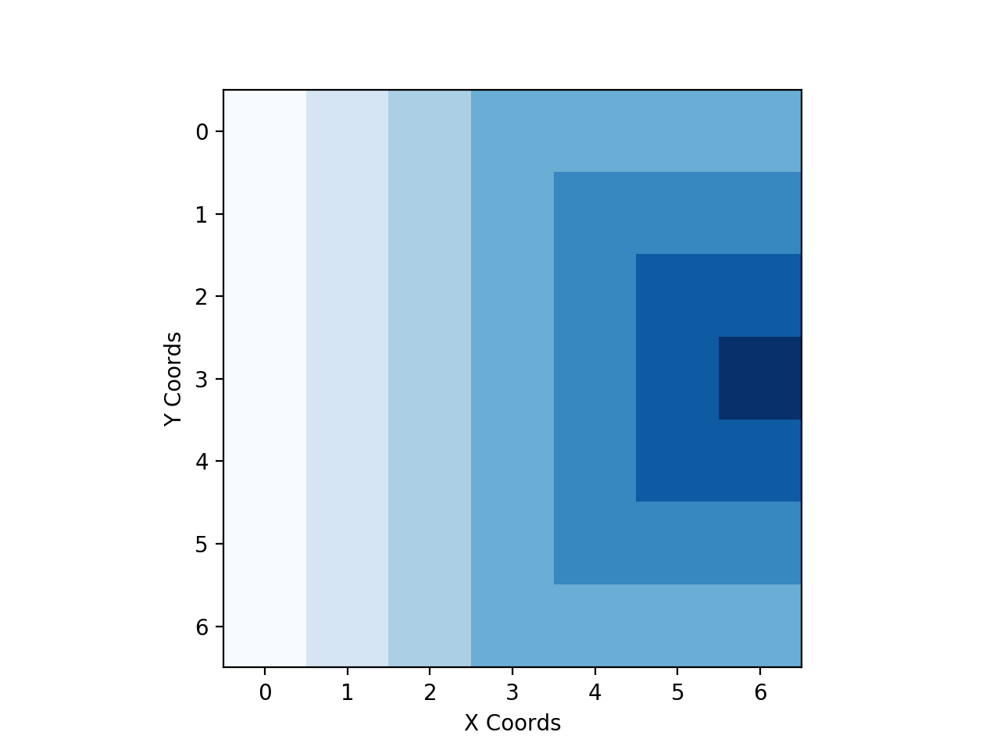
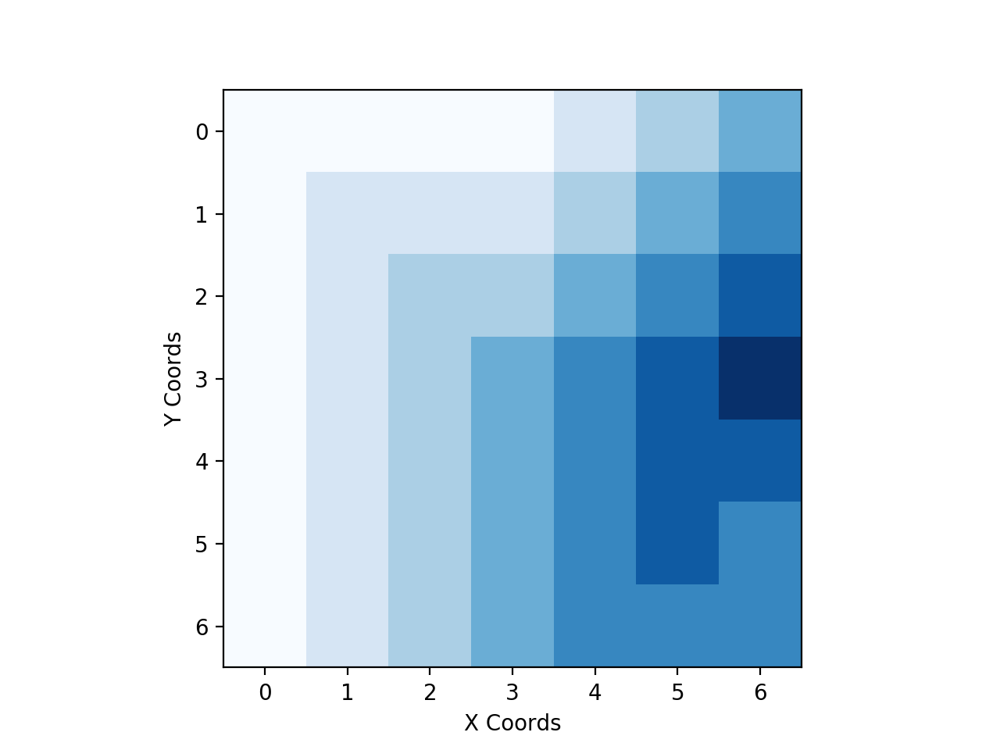

# ValueIteration

##### Some General Notes:
* for policies, the actions to be taken are given in cardinal directions N, S, E, W, NE, SE, NW, and SW. A period . means stay. 

### Case I: Windless

##### Value Function:

|   	| 00    | 01   	| 02   	| 03   	| 04   	| 05    | 06    |
|---	|------	|------	|------	|------	|------	|------	|------	|
| 00 	| -6.0 	| -5.0 	| -4.0 	| -3.0 	| -3.0 	| -3.0 	| -3.0 	|
| 01 	| -6.0 	| -5.0 	| -4.0 	| -3.0 	| -2.0 	| -2.0 	| -2.0 	|
| 02 	| -6.0 	| -5.0 	| -4.0 	| -3.0 	| -2.0 	| -1.0 	| -1.0 	|
| 03 	| -6.0 	| -5.0 	| -4.0 	| -3.0 	| -2.0 	| -1.0 	| 0.0  	|
| 04 	| -6.0 	| -5.0 	| -4.0 	| -3.0 	| -2.0 	| -1.0 	| -1.0 	|
| 05 	| -6.0 	| -5.0 	| -4.0 	| -3.0 	| -2.0 	| -2.0 	| -2.0 	|
| 06 	| -6.0 	| -5.0 	| -4.0 	| -3.0 	| -3.0 	| -3.0 	| -3.0 	|

##### Gradiant Visualization of the Value Function:

##### An Optimal Policy for Case 1:

|   	| 00 	| 01 	| 02 	| 03  	| 04  	| 05    | 06 	|
|---	|---	|---	|---	|----	|----	|----	|---	|
| 00 	| E 	| E 	| E 	| SE 	| S  	| S  	| S 	|
| 01 	| E 	| E 	| E 	| E  	| SE 	| S  	| S 	|
| 02 	| E 	| E 	| E 	| E  	| E  	| SE 	| S 	|
| 03 	| E 	| E 	| E 	| E  	| E  	| E  	| . 	|
| 04 	| E 	| E 	| E 	| E  	| E  	| NE 	| N 	|
| 05 	| E 	| E 	| E 	| E  	| NE 	| N  	| N 	|
| 06 	| E 	| E 	| E 	| NE 	| N  	| N  	| N 	|

##### Path from 3,0 to 3,6 for Case 1:

* ((3,0):E), ((3,1):E), ((3:2):E), ((3,3):E), ((3,4):E), ((3,5):E), ((3,6):.)

##### Another Path from 3,0 to 3,6 for Case 1:

* ((3,0):NE), ((2,1):E), ((2:2):SE), ((3,3):E), ((3,4):E), ((3,5):E), ((3,6):.)

### Case II: Weak Wind

##### Value Function:

|   	| 0    	| 1    	| 2    	| 3    	| 4    	| 5    	| 6    	|
|---	|------	|------	|------	|------	|------	|------	|------	|
| 0 	| -6.0 	| -6.0 	| -6.0 	| -5.0 	| -4.0 	| -3.0 	| -3.0 	|
| 1 	| -6.0 	| -5.0 	| -5.0 	| -4.0 	| -3.0 	| -2.0 	| -2.0 	|
| 2 	| -6.0 	| -5.0 	| -4.0 	| -3.0 	| -2.0 	| -1.0 	| -1.0 	|
| 3 	| -6.0 	| -5.0 	| -4.0 	| -3.0 	| -2.0 	| -1.0 	| 0.0  	|
| 4 	| -6.0 	| -5.0 	| -4.0 	| -3.0 	| -2.0 	| -1.0 	| -1.0 	|
| 5 	| -6.0 	| -5.0 	| -4.0 	| -3.0 	| -2.0 	| -2.0 	| -2.0 	|
| 6 	| -6.0 	| -5.0 	| -4.0 	| -3.0 	| -2.0 	| -2.0 	| -2.0 	|

##### Gradiant Visualization of the Value Function:

##### An Optimal Policy for Case 2:

|   	| 0    	| 1    	| 2    	| 3    	| 4    	| 5    	| 6    	|
|---	|------	|------	|------	|------	|------	|------	|------	|
| 0 	| SE	| SE 	| SE 	| SE 	| SE 	| SE 	| S 	|
| 1 	| E 	| SE 	| SE 	| SE 	| SE 	| SE 	| S 	|
| 2 	| E 	| E 	| SE 	| SE 	| SE 	| SE 	| S 	|
| 3 	| E 	| E 	| SE 	| SE 	| SE 	| E 	| .  	|
| 4 	| E 	| E 	| E 	| E 	| SE 	| NE 	| N 	|
| 5 	| E 	| E 	| E 	| E 	| E 	| NE 	| N 	|
| 6 	| E 	| E 	| E 	| E 	| NE 	| NE 	| N 	|

##### 3,0 to 3,6 for Case 2:

* ((3,0):E), ((3,1):E), ((3:2):SE), ((3,3):SE), ((3,4):SE), ((3,5):E), ((3,6):.)

##### Another 3,0 to 3,6 for Case 2:

* ((3,0):NE), ((2,1):SE), ((3:2):SE), ((3,3):SE), ((3,4):SE), ((3,5):E), ((3,6):.)

### Case III: Strong Wind

##### Value Function:

|   	| 0    	| 1    	| 2    	| 3    	| 4    	| 5    	| 6    	|
|---	|------	|------	|------	|------	|------	|------	|------	|
| 0 	| -8.0 	| -7.0 	| -6.0 	| -5.0 	| -4.0 	| -3.0 	| -3.0 	|
| 1 	| -8.0 	| -7.0 	| -6.0 	| -5.0 	| -4.0 	| -2.0 	| -2.0 	|
| 2 	| -7.0 	| -7.0 	| -6.0 	| -5.0 	| -3.0 	| -1.0 	| -1.0 	|
| 3 	| -6.0 	| -6.0 	| -6.0 	| -4.0 	| -2.0 	| -1.0 	| 0.0  	|
| 4 	| -6.0 	| -5.0 	| -5.0 	| -3.0 	| -2.0 	| -1.0 	| -1.0 	|
| 5 	| -6.0 	| -5.0 	| -4.0 	| -3.0 	| -2.0 	| -2.0 	| -2.0 	|
| 6 	| -6.0 	| -5.0 	| -4.0 	| -3.0 	| -2.0 	| -2.0 	| -2.0 	|

##### Gradiant Visualization of the Value Function:

##### An Optimal Policy for Case 3:

|   	| 0    	| 1    	| 2    	| 3    	| 4    	| 5    	| 6    	|
|---	|------	|------	|------	|------	|------	|------	|------	|
| 0 	| SE	| SE 	| S 	| SE 	| SE 	| SE 	| S 	|
| 1 	| SE 	| SE 	| S 	| SE 	| SE 	| SE	| S 	|
| 2 	| SE 	| SE 	| S 	| SE 	| SE 	| SE 	| S 	|
| 3 	| SE 	| SE 	| SE 	| SE 	| SE 	| E 	| .  	|
| 4 	| E 	| SE 	| SE 	| SE 	| SE 	| NE	| N 	|
| 5 	| E 	| E 	| SE 	| SE 	| SE 	| NE 	| N 	|
| 6 	| E 	| E 	| E 	| E 	| E 	| . 	| N 	|

##### 3,0 to 3,6 for Case 3:

* ((3,0):SE), ((4,1):SE), ((5:2):SE), ((4,3):SE), ((3,4):SE), ((2,5):SE), ((3,6):.)

### Changing the Wind Factor

To modify the wind factor (0 for none, 1 for 1 offset, 2 for 2, etc...), open valueIteration.py in your favorite editor and modify the value of the variable windFactor on line 9. 

### Compilation and Run

* We compiled the project with Python 3.6.0
* To run the project, run the command ./run.sh
    * note: this may install a few packages if you don't already have them
* Our script assumes your python 3 is aliased as 'python3'

### Authors

* Hasan Khan hk4cd
* Zachary Danz zsd4yr