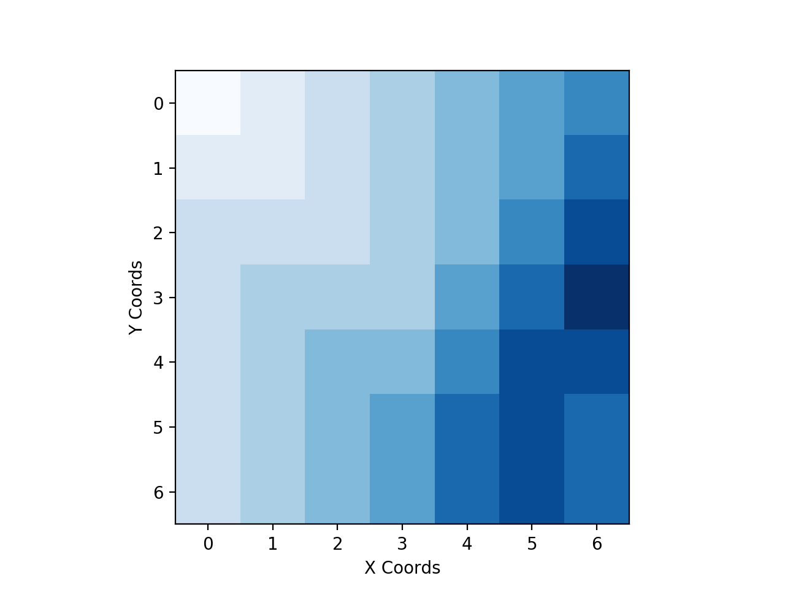

# ValueIteration

##### Some General Notes:
* for policies, the actions to be taken are given in cardinal directions N, S, E, W, NE, SE, NW, and SW. A period . means stay. 

### Case I: Windless

##### Value Function:

|   	| 00    | 01   	| 02   	| 03   	| 04   	| 05    | 06    |
|---	|------	|------	|------	|------	|------	|------	|------	|
| 00 	| -6.0 	| -5.0 	| -4.0 	| -3.0 	| -3.0 	| -3.0 	| -3.0 	|
| 01 	| -6.0 	| -5.0 	| -4.0 	| -3.0 	| -2.0 	| -2.0 	| -2.0 	|
| 02 	| -6.0 	| -5.0 	| -4.0 	| -3.0 	| -2.0 	| -1.0 	| -1.0 	|
| 03 	| -6.0 	| -5.0 	| -4.0 	| -3.0 	| -2.0 	| -1.0 	| 0.0  	|
| 04 	| -6.0 	| -5.0 	| -4.0 	| -3.0 	| -2.0 	| -1.0 	| -1.0 	|
| 05 	| -6.0 	| -5.0 	| -4.0 	| -3.0 	| -2.0 	| -2.0 	| -2.0 	|
| 06 	| -6.0 	| -5.0 	| -4.0 	| -3.0 	| -3.0 	| -3.0 	| -3.0 	|

##### Gradiant Visualization of the Value Function:

##### An Optimal Policy for Case 1:

|   	| 00 	| 01 	| 02 	| 03  	| 04  	| 05    | 06 	|
|---	|---	|---	|---	|----	|----	|----	|---	|
| 00 	| E 	| E 	| E 	| SE 	| S  	| S  	| S 	|
| 01 	| E 	| E 	| E 	| E  	| SE 	| S  	| S 	|
| 02 	| E 	| E 	| E 	| E  	| E  	| SE 	| S 	|
| 03 	| E 	| E 	| E 	| E  	| E  	| E  	| . 	|
| 04 	| E 	| E 	| E 	| E  	| E  	| NE 	| N 	|
| 05 	| E 	| E 	| E 	| E  	| NE 	| N  	| N 	|
| 06 	| E 	| E 	| E 	| NE 	| N  	| N  	| N 	|

##### Another Optimal Policy for Case 1:

|   	| 00 	| 01 	| 02 	| 03  	| 04  	| 05  	| 06 	|
|---	|---	|---	|---	|----	|----	|----	|---	|
| 00 	| E 	| E 	| E 	| SE 	| S  	| S  	| S 	|
| 01 	| E 	| E 	| E 	| E  	| SE 	| S  	| S 	|
| 02 	| E 	| `SE`	| E 	| E  	| E  	| SE 	| S 	|
| 03 	| E 	| E 	| E 	| E  	| E  	| E  	| . 	|
| 04 	| E 	| E 	| E 	| E  	| E  	| NE 	| N 	|
| 05 	| E 	| E 	| E 	| E  	| NE 	| N  	| N 	|
| 06 	| E 	| E 	| E 	| NE 	| N  	| N  	| N 	|

Notice the change in X1,Y2 from E to SE. Many permutations such as this can be created by modifying places such as this. In general this scenario exists when there is more than one equal neighbor with the optimal next value; in this case, there are 3 '-4' nodes next to the '-5' in question, and so picking any of the 3 of them is valid for an optimal solution. 

Because paths are derived at each cell by pointing towards the highest neighbor (for example, if the neighbors of a at a corner are '-5' are '-4', '-5', and '-5' then the '-4' will be pointed to); so if there is more than one equally highest neighbor then choosing either to point to is valid for an optimal solution.

### Case II: Weak Wind

##### Value Function:

|   	| 0    	| 1    	| 2    	| 3    	| 4    	| 5    	| 6    	|
|---	|------	|------	|------	|------	|------	|------	|------	|
| 0 	| -6.0 	| -6.0 	| -6.0 	| -5.0 	| -4.0 	| -3.0 	| -3.0 	|
| 1 	| -6.0 	| -5.0 	| -5.0 	| -4.0 	| -3.0 	| -2.0 	| -2.0 	|
| 2 	| -6.0 	| -5.0 	| -4.0 	| -3.0 	| -2.0 	| -1.0 	| -1.0 	|
| 3 	| -6.0 	| -5.0 	| -4.0 	| -3.0 	| -2.0 	| -1.0 	| 0.0  	|
| 4 	| -6.0 	| -5.0 	| -4.0 	| -3.0 	| -2.0 	| -1.0 	| -1.0 	|
| 5 	| -6.0 	| -5.0 	| -4.0 	| -3.0 	| -2.0 	| -2.0 	| -2.0 	|
| 6 	| -6.0 	| -5.0 	| -4.0 	| -3.0 	| -2.0 	| -2.0 	| -2.0 	|

##### Gradiant Visualization of the Value Function:

##### An Optimal Policy for Case 2:

|   	| 0    	| 1    	| 2    	| 3    	| 4    	| 5    	| 6    	|
|---	|------	|------	|------	|------	|------	|------	|------	|
| 0 	| SE	| SE 	| SE 	| SE 	| SE 	| SE 	| S 	|
| 1 	| E 	| SE 	| SE 	| SE 	| SE 	| SE 	| S 	|
| 2 	| E 	| E 	| E 	| SE 	| SE 	| SE 	| S 	|
| 3 	| E 	| E 	| E 	| SE 	| SE 	| E 	| .  	|
| 4 	| E 	| E 	| E 	| E 	| SE 	| NE 	| N 	|
| 5 	| E 	| E 	| E 	| E 	| E 	| NE 	| N 	|
| 6 	| E 	| E 	| E 	| E 	| NE 	| . 	| N 	|

### Case III: Strong Wind

##### Value Function:

|   	| 0    	| 1    	| 2    	| 3    	| 4    	| 5    	| 6    	|
|---	|------	|------	|------	|------	|------	|------	|------	|
| 0 	| -8.0 	| -7.0 	| -6.0 	| -5.0 	| -4.0 	| -3.0 	| -3.0 	|
| 1 	| -8.0 	| -7.0 	| -6.0 	| -5.0 	| -4.0 	| -2.0 	| -2.0 	|
| 2 	| -7.0 	| -7.0 	| -6.0 	| -5.0 	| -3.0 	| -1.0 	| -1.0 	|
| 3 	| -6.0 	| -6.0 	| -6.0 	| -4.0 	| -2.0 	| -1.0 	| 0.0  	|
| 4 	| -6.0 	| -5.0 	| -5.0 	| -3.0 	| -2.0 	| -1.0 	| -1.0 	|
| 5 	| -6.0 	| -5.0 	| -4.0 	| -3.0 	| -2.0 	| -2.0 	| -2.0 	|
| 6 	| -6.0 	| -5.0 	| -4.0 	| -3.0 	| -2.0 	| -2.0 	| -2.0 	|

##### Gradiant Visualization of the Value Function:

##### An Optimal Policy for Case 3:

|   	| 0    	| 1    	| 2    	| 3    	| 4    	| 5    	| 6    	|
|---	|------	|------	|------	|------	|------	|------	|------	|
| 0 	| SE	| SE 	| S 	| SE 	| SE 	| SE 	| S 	|
| 1 	| SE 	| SE 	| S 	| SE 	| SE 	| SE	| S 	|
| 2 	| SE 	| SE 	| S 	| SE 	| SE 	| SE 	| S 	|
| 3 	| E 	| SE 	| SE 	| SE 	| SE 	| E 	| .  	|
| 4 	| E 	| E 	| E 	| SE 	| SE 	| NE	| N 	|
| 5 	| E 	| E 	| E 	| SE 	| SE 	| NE 	| N 	|
| 6 	| E 	| E 	| E 	| E 	| E 	| . 	| N 	|

### Changing the Wind Factor

To modify the wind factor (0 for none, 1 for 1 offset, 2 for 2, etc...), open valueIteration.py in your favorite editor and modify the value of the variable windFactor on line 9. 

### Compilation and Run

* We compiled the project with Python 3.6.0
* To run the project, run the command ./run.sh
    * note: this may install a few packages if you don't already have them
* Our script assumes your python 3 is aliased as 'python3'

### Authors

* Hasan Khan hk4cd
* Zachary Danz zsd4yr